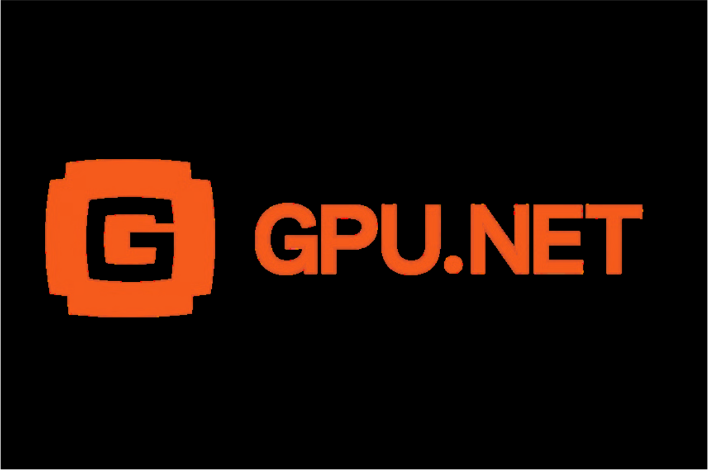

# GPU.NET - All in One GPU Ecosystem

A modern GPU marketplace application built with React, TailwindCSS v4, RainbowKit, and Wagmi.



## Live Demo
Check out the live demo at [https://assement-gpu.vercel.app/](https://assement-gpu.vercel.app/)

## Features

- 🎨 **Dark Theme UI** - Sleek dark interface with orange highlights
- 💼 **Wallet Integration** - Connect your crypto wallet using RainbowKit
- 🖥️ **GPU Marketplace** - Browse and rent GPU resources
- 📊 **Real-time Stats** - View datacenter statistics and metrics
- 💬 **Social Feed** - Interact with the community
- 🔍 **Advanced Filters** - Filter GPUs by location, type, and storage
- 📱 **Responsive Design** - Works seamlessly across devices

## Tech Stack

- **React 19** - UI framework
- **TypeScript** - Type safety
- **TailwindCSS v4** - Utility-first styling
- **RainbowKit** - Wallet connection UI
- **Lucide React** - Icon library
- **Bun** - Fast JavaScript runtime and package manager

## Getting Started

### Prerequisites

- Node.js 18+ or Bun
- A WalletConnect Project ID (get one at [WalletConnect Cloud](https://cloud.walletconnect.com/))

### Installation

1. Clone the repository:
```bash
git clone <your-repo-url>
cd frontend
```

2. Install dependencies:
```bash
bun install
# or
npm install
```

3. Configure WalletConnect:

Open `src/config/wagmi.ts` and replace `YOUR_PROJECT_ID` with your actual WalletConnect Project ID:
```typescript
export const config = getDefaultConfig({
  appName: 'GPU.NET',
  projectId: 'YOUR_PROJECT_ID', // Replace this
  chains: [mainnet, polygon, optimism, arbitrum, base],
  ssr: false,
});
```

4. Start the development server:
```bash
bun dev
# or
npm run dev
```

5. Open [http://localhost:5173](http://localhost:5173) in your browser

## Project Structure

```
src/
├── components/         # React components
│   ├── Sidebar.tsx     # Left sidebar with navigation
│   ├── Header.tsx      # Main header with stats
│   ├── Marquee.tsx     # Announcement marquee
│   ├── StatsCards.tsx  # Datacenter statistics
│   ├── GpuGrid.tsx     # GPU listings grid
│   ├── Feed.tsx        # Social feed sidebar
│   └── MainContent.tsx # Main content wrapper
├── context/            # React Context for state management
│   └── AppContext.tsx  # App-wide state (feed, wallet, filters)
├── config/             # Configuration files
│   └── wagmi.ts        # Wagmi/RainbowKit configuration
├── App.tsx             # Root application component
├── main.tsx            # Application entry point
└── index.css           # Global styles and Tailwind imports
```


## Building for Production

```bash
bun run build
# or
npm run build
```

The built files will be in the `dist` directory.

## Environment Variables

Create a `.env` file in the root directory:

```env
VITE_WALLETCONNECT_PROJECT_ID=your_project_id_here
```
## Features Overview

### Wallet Connection
The app uses RainbowKit for a beautiful wallet connection experience. Users can connect their Ethereum wallets (MetaMask, WalletConnect, Coinbase Wallet, etc.) to interact with the platform.

### GPU Marketplace
Browse available GPU resources with detailed specifications:
- GPU Model (H100 PCIe, A100, etc.)
- CPU specifications
- RAM and VRAM details
- Storage type
- Hourly pricing
- Location information

### Social Feed
Engage with the community through the integrated feed:
- Post updates
- Like and comment on posts
- Share images
- Use hashtags
- View engagement metrics

### State Management
The app uses React Context API for centralized state management:
- Feed posts
- Wallet balance
- GPU listings
- Filter preferences